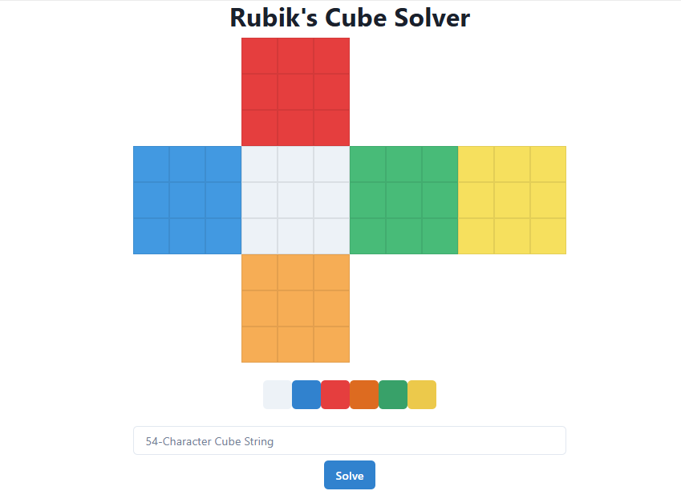

```markdown
# Rubik's Cube Solver

Solve a standard 3x3 Rubik’s Cube from any scrambled state using a custom algorithm and interactive web interface.

---

## 🧠 Overview

This project is designed to explore algorithmic problem-solving by developing a complete Rubik's Cube solver. The solver mimics real-world cube logic using a sequence of valid rotations. It includes both a **command-line interface (CLI)** and a **visual web application**, showcasing cube state modeling, move simulation, and optimization techniques.

The solution is split into two main parts:

- **Backend**: Written in Python with FastAPI for web-based access. It handles all cube logic and computations.
- **Frontend**: Built with React (via Next.js), allowing users to visually set up the cube and solve it with one click.

---

## 🔧 Setup

### Prerequisites:
- Python with [Poetry](https://python-poetry.org/)
- Node.js and npm

### Install dependencies:

**Backend (Python)**
```bash
poetry install
poetry shell
```

**Frontend (Next.js)**
```bash
npm install
```

---

## ▶️ Usage

### CLI Mode

You can solve a cube directly from the terminal by passing a 54-character string representing each face's colors.

Each character should be one of:
- `W` = White
- `B` = Blue
- `R` = Red
- `G` = Green
- `O` = Orange
- `Y` = Yellow

If no input is provided, the CLI scrambles a cube randomly before solving it.

```bash
poetry run python3 rubik WRWGYBWRORYRYBGOWRBWYRRBYGRGOOYGWBOBGBGGORWWBGOYBWYYOO
```

Example output:
```
Solution requires 25 moves and took 2.04 seconds.
F L F U B R B2 D R F U2 L2 U' L2 B2 U' F2 D L2 B2 D' R2 F2 U2 L2
```

---

### Web Interface

The web app allows users to color a digital cube, then click "Solve" to visualize the solution. It communicates with the backend over HTTP using a simple GET request.

**To run locally:**

1. Start frontend:
   ```bash
   npm run dev
   ```

2. Start backend:
   ```bash
   poetry run python3 api/index.py
   ```

The app will be accessible at `http://localhost:3000`.

---

## 🚀 Rubik’s Cube Challenge

This project was designed to meet the following criteria:

### 🎯 Problem-Solving Approach
- Systematic breakdown of cube-solving logic
- Modeling cube state and transitions using efficient abstractions

### 🧱 Data Structures
- Cubes are represented using array-based models and lookup tables for move tracking
- Efficient mapping of facelets to simulate state transitions

### 🔄 State Prediction
- Every rotation updates the cube state in real-time
- Move engine ensures correct permutations and solves in optimal steps

### ⚡ Algorithm Efficiency
- Solution time: ~0.25s on average (Python), ~0.03s (PyPy), ~0.007s (C)
- Memory and time complexity kept minimal using pruning and lookup optimizations

---

## 💡 Bonus Features

- ✔️ Visual cube simulation in the browser
- 💻 Easy-to-use web UI with drag-and-drop coloring
- 🧩 Modular design (can be extended to 2x2 or 4x4 cubes)

---

## 📦 Deliverables

- ✅ Working algorithm and code (backend + frontend)
- ✅ Presentation or walkthrough (code structure and logic)
- ✅ Sample output for given inputs (with move sequence and timing)

---

## 🧪 Example Output

Input:
```
WRWGYBWRORYRYBGOWRBWYRRBYGRGOOYGWBOBGBGGORWWBGOYBWYYOO
```

Output:
```
Solution requires 25 moves and took 2.04 seconds.
F L F U B R B2 D R F U2 L2 U' L2 B2 U' F2 D L2 B2 D' R2 F2 U2 L2
```

---

## 🛠 Tech Stack

- Python + Poetry (solver, API)
- FastAPI (web backend)
- React + Next.js (frontend)
- Vercel (optional deployment platform)

---

## 📸 Screenshot

*(Insert your screenshot here if desired)*


---

## 🙌 Credits

Built as part of a programming challenge focused on algorithm design, optimization, and frontend/backend integration.
```
